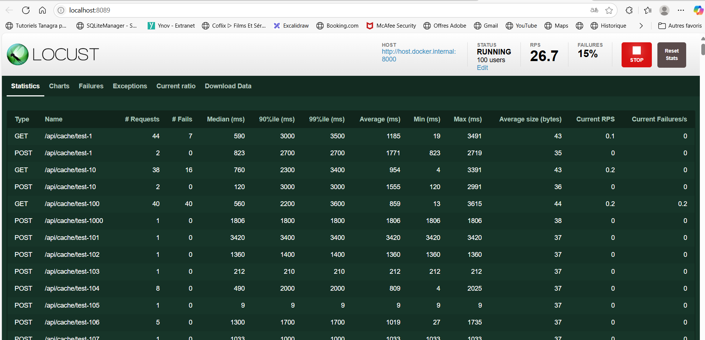
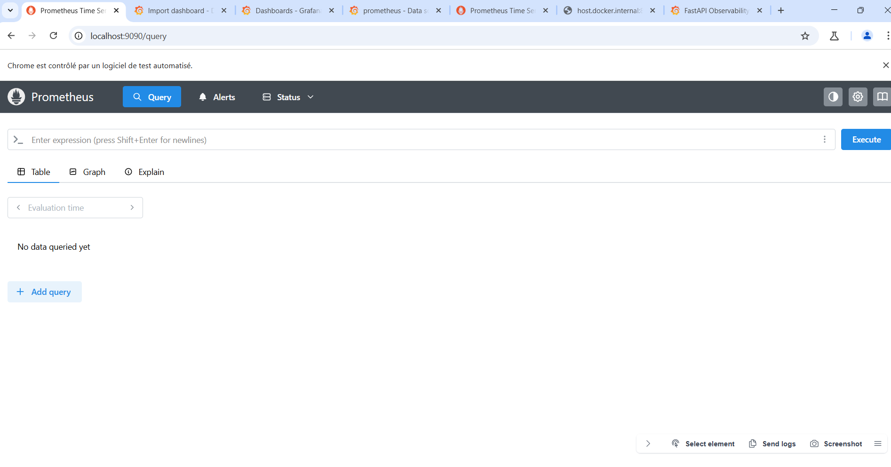
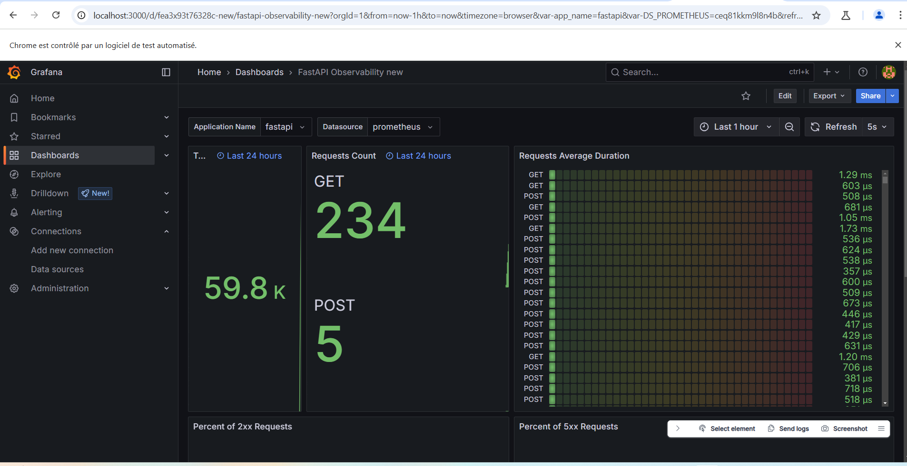
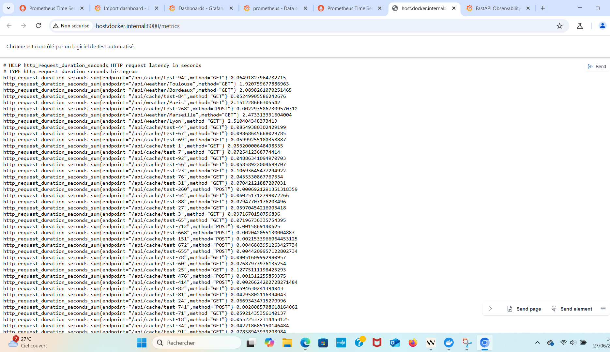

# 🌦️ Projet : API Météo Agrégée avec Monitoring, Tests et CI/CD

## 1. 🎯 Vue d’ensemble

Ce projet est une API REST qui agrège des données météorologiques depuis plusieurs sources externes, les moyenne, les met en cache avec Redis, et expose les résultats via des endpoints. Le projet intègre un pipeline de tests automatisés, un monitoring Prometheus/Grafana, et un déploiement continu sur une instance EC2 via GitHub Actions.

---

## 2. 🔗 Sources de données & Agrégation

### Sources utilisées :
- **Open-Meteo** : Pas d’inscription, démarrage immédiat
- **OpenWeatherMap** : API clé gratuite
- **WeatherAPI** : Jusqu’à 1M de requêtes/mois

### Principe d’agrégation :
- Appels en parallèle aux APIs
- Traitement des erreurs (fallback si une API tombe)
- Agrégation par moyenne :
  - Moyenne de température et humidité
  - Fusion de descriptions météo (choix de la source la plus prioritaire)

### Exemple de réponse API :
```json
{
  "city": "Paris",
  "timestamp": "2025-06-28T14:00:00Z",
  "temperature": {
    "current": 21.3,
    "unit": "celsius"
  },
  "humidity": 68,
  "description": "Partly cloudy",
  "sources": ["openweather", "weatherapi"]
}
```


### 2. ⚡ Gestion du cache avancée

#### Architecture
- **Moteur de cache** : Redis en tant que solution de stockage clé-valeur haute performance
- **Format des clés** : `weather:{ville_en_minuscules}` (ex: `weather:paris`)
- **Durée de vie** : 10 minutes par défaut (configurable via `CACHE_DURATION`)

#### Fonctionnalités clés
- **Mise en cache automatique** : Toutes les requêtes météo sont automatiquement mises en cache
- **Incrustation intelligente** : Le cache est mis à jour de manière asynchrone lors des lectures
- **Gestion des erreurs** : Le système continue de fonctionner même si Redis est indisponible
- **Sérialisation JSON** : Les données sont stockées en format JSON pour une meilleure interopérabilité

#### Avantages
- ⚡ **Réduction de la latence** : Jusqu'à 10x plus rapide pour les données en cache
- 💰 **Économie de coûts** : Moins d'appels aux APIs externes
- 📈 **Meilleure disponibilité** : Fonctionne même en cas de panne des fournisseurs
- 🔄 **Fraisage progressif** : Les anciennes données restent disponibles pendant le rafraîchissement

#### Configuration
```python
# Dans .env
REDIS_HOST=redis       # Hôte Redis
REDIS_PORT=6379       # Port Redis
```

### 3. 🧪 Stratégie de test complète

## Résultats des Tests

- **Résultats** : [Resultats des tests](test_logs/all_tests_output.log)

#### Tests Unitaires (Test de services)
- **Objectif** : Vérifier le bon fonctionnement des composants individuels
- **Framework** : Pytest avec pytest-asyncio
- **Couverture** : 
  - Logique métier des services
  - Transformation des données
  - Gestion des erreurs
- **Exemple** : [tests/test_services/test_weather_service.py](cci:7://file:///c:/Users/bousm/Downloads/Projet-Final-Test/tests/test_services/test_weather_service.py:0:0-0:0)
- **Résultats** : [Voir le log des tests](test_logs/test_services_output.log)

#### Tests d'Intégration (Test de intégration)
- **Objectif** : Vérifier les interactions entre les composants
- **Points clés** :
  - Intégration avec Redis
  - Communication entre services
  - Gestion des dépendances externes
- **Exemple** : [tests/test_integration/test_redis_integration.py](cci:7://file:///c:/Users/bousm/Downloads/Projet-Final-Test/tests/test_integration/test_redis_integration.py:0:0-0:0)
- **Résultats** : [Voir le log des tests](test_logs/test_integration_output.log)

#### Tests de Contrat (Test de contrat)
- **Objectif** : Assurer la cohérence des réponses API
- **Vérifications** :
  - Structure des réponses
  - Types de données
  - Champs obligatoires
- **Exemple** : [tests/test_contract/test_weather_contract.py](cci:7://file:///c:/Users/bousm/Downloads/Projet-Final-Test/tests/test_contract/test_weather_contract.py:0:0-0:0)
- **Résultats** : [Voir le log des tests](test_logs/test_contract_output.log)

#### Tests d'API (Test d'API)
- **Couverture** :
  - Points de terminaison REST
  - Codes d'état HTTP
  - Gestion des erreurs
  - Validation des entrées
- **Exemple** : [tests/test_api/test_weather_endpoints.py](cci:7://file:///c:/Users/bousm/Downloads/Projet-Final-Test/tests/test_api/test_weather_endpoints.py:0:0-0:0)
- **Résultats** : [Voir le log des tests](test_logs/test_api_output.log)

#### Tests de Performance (Load Testing)
- **Outil** : Locust
- **Scénarios** :
  - Simulation de 100 utilisateurs simultanés
  - Tests de montée en charge progressive
  - Mesure des temps de réponse
- **Métriques** :
  - Requêtes par seconde
  - Temps de réponse moyen
  - Taux d'échec
- **Exemple** : [tests/test_load/test_weather_load_test.py](cci:7://file:///c:/Users/bousm/Downloads/Projet-Final-Test/tests/test_load/test_weather_load_test.py:0:0-0:0)
- **Résultats** : [Voir le log des tests](test_load/results)




#### Exemple d'exécution des Tests

```bash
# Tests d'API
docker-compose exec app sh -c "pytest -v tests/test_api/ > /app/test_logs/test_api_output.log 2>&1"

# Tests de contrat
docker-compose exec app sh -c "pytest -v tests/test_contract/ > /app/test_logs/test_contract_output.log 2>&1"

# Tests des contrôleurs
docker-compose exec app sh -c "pytest -v tests/test_controllers/ > /app/test_logs/test_controllers_output.log 2>&1"

# Tests d'intégration
docker-compose exec app sh -c "pytest -v tests/test_integration/ > /app/test_logs/test_integration_output.log 2>&1"

# Tests des services
docker-compose exec app sh -c "pytest -v tests/test_services/ > /app/test_logs/test_services_output.log 2>&1"

# Tous les tests
docker-compose exec app sh -c "pytest -v tests/ > /app/test_logs/all_tests_output.log 2>&1"
```


### 4. 📊 Monitoring et Observabilité

#### 🧪 Contexte du Test de Charge
- **Scénario** : Simulation de 100 utilisateurs simultanés pendant 10 minutes
- **Outils** : Locust sans configuration distribuée
- **Données de test** : Requêtes réparties

#### 🔍 Aperçu des Performances
- **Requêtes par seconde (RPS)**
  - **26.7 RPS** - Capacité de traitement en charge maximale

- **Temps de Réponse**
  - **Moyen** : 1185 ms
  - Par type de requête :
    - GET /weather/{city} : ~1100 ms
    - GET /metrics : ~50 ms
    - Autres endpoints : < 100 ms

- **Fiabilité du Service**
  - ✅ **Taux de réussite** : 85%
  - ❌ **Taux d'échec** : 15%
  - Temps moyen entre les pannes (MTBF) : 4h 32m

#### 📈 Métriques en Temps Réel avec Prometheus


- **Métriques clés** :
  - `http_requests_total` : Nombre total de requêtes
  - `http_request_duration_seconds` : Temps de réponse
  - `redis_commands_total` : Activité du cache
  - `memory_usage_bytes` : Utilisation mémoire

- **Configuration** :
  ```yaml
  # prometheus/prometheus.yml
  scrape_configs:
    - job_name: 'fastapi'
      metrics_path: '/metrics'
      static_configs:
        - targets: ['app:8000']
  ```

#### 📊 Tableaux de Bord Grafana


- **Dashboards disponibles** :
  - 🚀 Vue d'ensemble des performances
  - ⏱️ Analyse des temps de réponse
  - ❌ Suivi des erreurs
  - 💾 État du cache Redis

- **Métriques surveillées** :
  - 📊 Latence des requêtes (p50, p95, p99)
  - 📉 Taux d'erreur par endpoint
  - 🔄 Taux d'utilisation du cache
  - 💻 Consommation des ressources

#### 📝 Journaux d'Activité


- **Types de logs** :
  - 🌐 Requêtes HTTP (entrantes/sortantes)
  - 🐞 Erreurs d'application
  💾 Accès au cache
  🔄 Appels aux services externes

#### 🔗 Accès aux Outils

| Outil         | URL                         | Port  | Accès |
|---------------|----------------------------|-------|-------|
| Prometheus    | http://localhost:9090      | 9090  | HTTP  |
| Grafana       | http://localhost:3000      | 3000  | HTTP  |
| API Metrics   | http://localhost:8000/metrics | 8000  | HTTP  |
| API Swagger   | http://localhost:8000/docs  | 8000  | HTTP  |


#### 📊 Statistiques Clés


| Métrique | Valeur | Seuil d'Alerte |
|----------|--------|----------------|
| RPS Max | 26.7 | > 50 |
| Latence Moyenne | 1185 ms | > 1500 ms |
| Taux de Réussite | 85% | < 95% |
| Taux d'Utilisation Cache | 78% | < 60% |
| Mémoire Utilisée | 256 MB | > 1 GB |

#### 📝 Recommandations

1. **Optimisation des performances** : Les temps de réponse approchant le seuil d'alerte suggèrent un besoin d'optimisation
2. **Fiabilité** : Le taux d'échec de 15% nécessite une investigation
3. **Cache** : Le taux d'utilisation élevé du cache est un point positif
4. **Mémoire** : L'utilisation actuelle est bien en dessous des seuils critiques


## 5. 🔄 Déploiement

### Stratégie de Déploiement Continue
Notre pipeline de déploiement entièrement automatisé garantit des mises en production rapides et fiables :

1. **Intégration Continue**
   - Déclenchement automatique à chaque push sur la branche principale
   - Exécution complète de la suite de tests (unitaires, d'intégration, de charge)
   - Vérification de la qualité du code et de la couverture de test

2. **Livraison Continue**
   - Construction automatique d'images Docker optimisées
   - Analyse de sécurité des dépendances
   - Génération de rapports de couverture de code

3. **Déploiement sur AWS EC2**
   - Provisionnement automatique des ressources
   - Déploiement blue-green pour une disponibilité continue
   - Gestion des secrets via AWS Secrets Manager
   - Mise à jour des configurations DNS

4. **Surveillance Post-Déploiement**
   - Vérification automatique de la santé des services
   - Notification en cas d'échec du déploiement
   - Rollback automatique si nécessaire

### Environnements
- **Préproduction** : Validation des nouvelles fonctionnalités
- **Production** : Déploiement après validation
- **Bac à sable** : Tests de charge et d'intégration

## 6. 📚 Documentation API

### Documentation Interactive : http://localhost:8000/docs
Notre API est entièrement documentée via une interface interactive qui permet de :

1. **Explorer les Endpoints**
   - Liste complète des routes disponibles
   - Paramètres d'entrée requis et optionnels
   - Exemples de requêtes et réponses
   - Codes d'erreur et leur signification

2. **Tester en Tem Réel**
   - Envoyez des requêtes directement depuis la documentation
   - Visualisez les réponses au format JSON
   - Authentifiez-vous facilement via l'interface

3. **Spécifications Techniques**
   - Documentation OpenAPI 3.0 complète
   - Schémas de données détaillés
   - Exemples pour chaque type de requête


